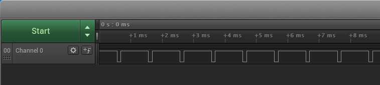

# AC PWM generation

This example application shows how to use the Analog Comparator Peripheral library to generate a 1KHz PWM waveform.

## Description

The AC peripheral is configured to generate analog PWM waveform by comparing the sine wave generated from the DAC with the reference voltage selected as a VDD scaler. The duty cycle of the analog PWM is changed by pressing a switch which changes the value of the VDD scaler.

## Downloading and building the application

To clone or download this application from Github, go to the [main page of this repository](https://github.com/Microchip-MPLAB-Harmony/csp_apps_sam_c20_c21) and then click **Clone** button to clone this repository or download as zip file.
This content can also be downloaded using content manager by following these [instructions](https://github.com/Microchip-MPLAB-Harmony/contentmanager/wiki).

Path of the application within the repository is **apps/ac/ac_wav_gen/firmware** .

To build the application, refer to the following table and open the project using its IDE.

| Project Name      | Description                                    |
| ----------------- | ---------------------------------------------- |
| sam_c21n_xpro.X | MPLABX project for [SAMC21N Xplained Pro Evaluation Kit](https://www.microchip.com/developmenttools/ProductDetails/atsamc21n-xpro) |
|||

## Setting up the hardware

The following table shows the target hardware for the application projects.

| Project Name| Board|
|:---------|:---------:|
| sam_c21n_xpro.X | [SAMC21N Xplained Pro Evaluation Kit](https://www.microchip.com/developmenttools/ProductDetails/atsamc21n-xpro)
|||

### Setting up [SAMC21N Xplained Pro Evaluation Kit](https://www.microchip.com/developmenttools/ProductDetails/atsamc21n-xpro)

- Use a jumper wire to connect pin PA04 "Pin 3 of the VREF connector" and PA02 "Pin DAC_VOUT on the DAC Header"
- Use the Logic Analyzer/Oscilloscope and probe PA12 pin (Pin 14 of the EXT1 header) to observe the PWM output
- Connect the Debug USB port on the board to the computer using a micro USB cable

## Running the Application

1. Build and Program the application using its IDE

2. Observe the PWM waveform using the oscilloscope connected to the PWM output pin

    

3. Press switch to change the duty cycle of PWM waveform

Refer to the following table for pwm output and switch details:

| Board| PWM output pin | Switch|
|------|----------------| ------ |
| [SAMC21N Xplained Pro Evaluation Kit](https://www.microchip.com/developmenttools/ProductDetails/atsamc21n-xpro) |PA12 pin (Pin 14 of the EXT1 header) | SW0 ||
|||
