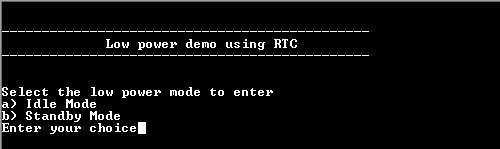
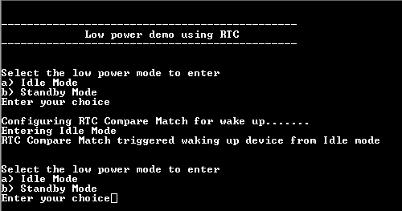

# PM wakeup using RTC

This example demonstrates entering the low power modes and exiting it using the RTC.

## Description

The PM Peripheral library is used to enter into the low power modes, and uses the RTC timer to wake up the device from the low power mode. The RTC peripheral is run continuously, including in the device's low-power sleep modes. The RTC counter value is continuously compared with the Compare registers and generates compare match interrupt when compare match occurs to wake up the device.

## Downloading and building the application

To download or clone this application from Github, go to the [top level of the repository](https://github.com/Microchip-MPLAB-Harmony/csp_apps_sam_c20_c21) and click

Path of the application within the repository is **apps/pm/pm_wakeup_rtc/firmware** .

To build the application, refer to the following table and open the project using its IDE.

| Project Name      | Description                                    |
| ----------------- | ---------------------------------------------- |
| sam_c21n_xpro.X | MPLABX project for [SAMC21N Xplained Pro Evaluation Kit](https://www.microchip.com/developmenttools/ProductDetails/atsamc21n-xpro) |
|||

## Setting up the hardware

The following table shows the target hardware for the application projects.

| Project Name| Board|
|:---------|:---------:|
| sam_c21n_xpro.X | [SAMC21N Xplained Pro Evaluation Kit](https://www.microchip.com/developmenttools/ProductDetails/atsamc21n-xpro)
|||

### Setting up [SAMC21N Xplained Pro Evaluation Kit](https://www.microchip.com/developmenttools/ProductDetails/atsamc21n-xpro)

- Connect the Debug USB port on the board to the computer using a micro USB cable

## Running the Application

1. Open the Terminal application (Ex.:Tera term) on the computer
2. Connect to the EDBG Virtual COM port and configure the serial settings as follows:
    - Baud : 115200
    - Data : 8 Bits
    - Parity : None
    - Stop : 1 Bit
    - Flow Control : None
3. Build and Program the application using its IDE
4. LED is blinked continuously using the SysTick Timer
5. The console displays the following message

    

6. Select 'a' or 'b' to enter the low power mode (LED is turned off when the device enters low power mode)
7. When the device wakes up on RTC compare match interrupt, the LED starts blinking and the console displays the following
message

    

The following table provides the details of LED

| Board      | LED Name   |
| ---------- | ---------- |
| [SAMC21N Xplained Pro Evaluation Kit](https://www.microchip.com/developmenttools/ProductDetails/atsamc21n-xpro) | LED0 |
||||
