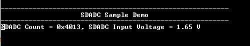

# SDADC Sample

This example application shows how to sample an analog input using SDADC and displays the converted samples on a serial terminal.

## Description

In this application, the DAC output is fed to an analog input for the SDADC conversion. An analog input is converted by a software trigger and the converted value is displayed on the console. DAC output is changed by 0.1 V upon switch press. The SDADC sample output is between 0.0 V to 3.3 V and it starts from 1.65 V when device is reset.

## Downloading and building the application

To clone or download this application from Github, go to the [main page of this repository](https://github.com/Microchip-MPLAB-Harmony/csp_apps_sam_c20_c21) and then click **Clone** button to clone this repository or download as zip file.
This content can also be downloaded using content manager by following these [instructions](https://github.com/Microchip-MPLAB-Harmony/contentmanager/wiki).

Path of the application within the repository is **apps/sdadc/sdadc_sample/firmware** .

To build the application, refer to the following table and open the project using its IDE.

| Project Name      | Description                                    |
| ----------------- | ---------------------------------------------- |
| sam_c21n_xpro.X | MPLABX project for [SAMC21N Xplained Pro Evaluation Kit](https://www.microchip.com/developmenttools/ProductDetails/atsamc21n-xpro) |
|||

## Setting up the hardware

The following table shows the target hardware for the application projects.

| Project Name| Board|
|:---------|:---------:|
| sam_c21n_xpro.X | [SAMC21N Xplained Pro Evaluation Kit](https://www.microchip.com/developmenttools/ProductDetails/atsamc21n-xpro)
|||

### Setting up [SAMC21N Xplained Pro Evaluation Kit](https://www.microchip.com/developmenttools/ProductDetails/atsamc21n-xpro)

- Analog input (AIN1) of SDADC is fed from the DAC output.
  - SDADC "INP1" is mapped to Port Pin "PB09", and is routed to "Pin 3 of the EXT1 header"
  - SDADC "INN1" is mapped to Port Pin "PB08", and is routed to "Pin4 of the EXT1 header"
  - DAC output is available between Port Pin "PA02" and GND pin and these are routed to "Pin 1 and Pin 2 of the DAC header"
- Use the jumper wires to connect below pins:
  - "Pin 3 of the EXT1 header" to "Pin 1 of the DAC header"
  - "Pin 4 of the EXT1 header" to "Pin 2 of the DAC header"
- Connect the Debug USB port on the board to the computer using a micro USB cable

## Running the Application

1. Open the Terminal application (Ex.:Tera term) on the computer
2. Connect to the EDBG Virtual COM port and configure the serial settings as follows:
    - Baud : 115200
    - Data : 8 Bits
    - Parity : None
    - Stop : 1 Bit
    - Flow Control : None
3. Build and Program the application project using its IDE
4. The console displays the converted digital value
5. Press the switch to change the DAC value by 0.1 V and observe the changed SDADC value on the console

Refer to the table below for details of the switch used:

| Board | Switch |
|:------|:------:|
| [SAMC21N Xplained Pro Evaluation Kit](https://www.microchip.com/developmenttools/ProductDetails/atsamc21n-xpro) | SW0 |

6. Console displays the SDADC count and the SDADC input voltage in the console as shown below:

    