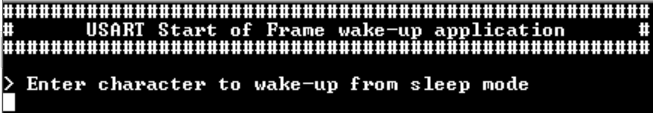
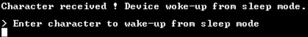

# SERCOM USART Start of Frame (SOF) interrupt 

This example application demonstrates how to use the SERCOM peripheral in USART ring buffer mode with SoF to wake-up device from sleep mode.

## Description

This example demonstrates how to wake-up from sleep mode using USART + Start of Frame feature. The USART is configured in ring-buffer mode (interrupts enabled). The example asks the user to enter 1 character. Once received, the device wake-up from sleep, displays a message then go back to sleep. For this example the Standby mode is default sleep mode used.

## Downloading and building the application

To clone or download this application from Github, go to the [main page of this repository](https://github.com/Microchip-MPLAB-Harmony/csp_apps_sam_c20_21) and then click **Clone** button to clone this repository or download as zip file.
This content can also be downloaded using content manager by following these [instructions](https://github.com/Microchip-MPLAB-Harmony/contentmanager/wiki).

Path of the application within the repository is **apps/sercom/usart/usart_sof_interrupt/firmware** .

To build the application, refer to the following table and open the project using its IDE.

| Project Name      | Description                                    |
| ----------------- | ---------------------------------------------- |
| sam_c21_xpro.X | MPLABX project for [SAMC21 Xplained Pro Evaluation Kit](https://aem-origin.microchip.com/en-us/development-tool/ATSAMC21N-XPRO) |
|||

## Setting up the hardware

The following table shows the target hardware for the application projects.

| Project Name| Board|
|:---------|:---------:|
| sam_c21_xpro.X | [SAMC21 Xplained Pro Evaluation Kit](https://aem-origin.microchip.com/en-us/development-tool/ATSAMC21N-XPRO)
|||

### Setting up [SAMC21 Xplained Pro Evaluation Kit](https://aem-origin.microchip.com/en-us/development-tool/ATSAMC21N-XPRO)

- Connect the Debug USB port on the board to the computer using a micro USB cable

## Running the Application

1. Open the Terminal application (Ex.:Tera term) on the computer
2. Connect to the EDBG Virtual COM port and configure the serial settings as follows:
    - Baud : 115200
    - Data : 8 Bits
    - Parity : None
    - Stop : 1 Bit
    - Flow Control : None
3. Build and Program the application using its IDE
4. The console displays the following message

    

    - Console displays the application header followed by message
	- The message asks user to "Enter character to wake-up from sleep mode"
    - *NOTE: For this example, the sleep mode used is Standby mode*

5. Enter 1 character on terminal
6. The device will wake-up and display message below:

    

7. Then device will go back to sleep until new character is entered
