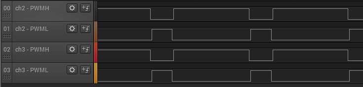

# TCC PWM generation

This example application shows how to use the TCC to generate a 2 or 3 phase PWM signals for motor control with dead time.

## Description

TCC module is configured to generate synchronous 2 or 3 phase PWM signals with dead time. The duty cycle of the PWM signals is updated in the period interrupt handler.

## Downloading and building the application

To download or clone this application from Github, go to the [top level of the repository](https://github.com/Microchip-MPLAB-Harmony/csp_apps_sam_c20_c21) and click

Path of the application within the repository is **apps/tcc/tcc_synchronous_pwm_channels/firmware** .

To build the application, refer to the following table and open the project using its IDE.

| Project Name      | Description                                    |
| ----------------- | ---------------------------------------------- |
| sam_c21n_xpro.X | MPLABX project for [SAMC21N Xplained Pro Evaluation Kit](https://www.microchip.com/developmenttools/ProductDetails/atsamc21n-xpro) |
|||

## Setting up the hardware

The following table shows the target hardware for the application projects.

| Project Name| Board|
|:---------|:---------:|
| sam_c21n_xpro.X | [SAMC21N Xplained Pro Evaluation Kit](https://www.microchip.com/developmenttools/ProductDetails/atsamc21n-xpro)
|||

### Setting up [SAMC21N Xplained Pro Evaluation Kit](https://www.microchip.com/developmenttools/ProductDetails/atsamc21n-xpro)

- Connect the Debug USB port on the board to the computer using a micro USB cable

## Running the Application

1. Build and Program the application using its IDE
2. Observe the high-side and low-side PWM waveforms on oscilloscope
3. Observe the dead time between the high side and the low side
4. Observe the pwm frequency to be 10 KHz

[SAMC21N Xplained Pro Evaluation Kit](https://www.microchip.com/developmenttools/ProductDetails/atsamc21n-xpro) pin details:

|Signal Name| Pad   | Pin |
|-----------|-------|-----|
| ch2-PWMH  | PA10  | Pin 5 of EXT1 connector |
| ch2-PWML  | PB12  | Pin 7 of EXT1 connector  |
| ch3-PWMH  | PA11  | Pin 6 of EXT1 connector |
| ch3-PWML  | PB13  | Pin 8 of EXT1 connector |
||||

[SAMC21N Xplained Pro Evaluation Kit](https://www.microchip.com/developmenttools/ProductDetails/atsamc21n-xpro) waveforms:

  
